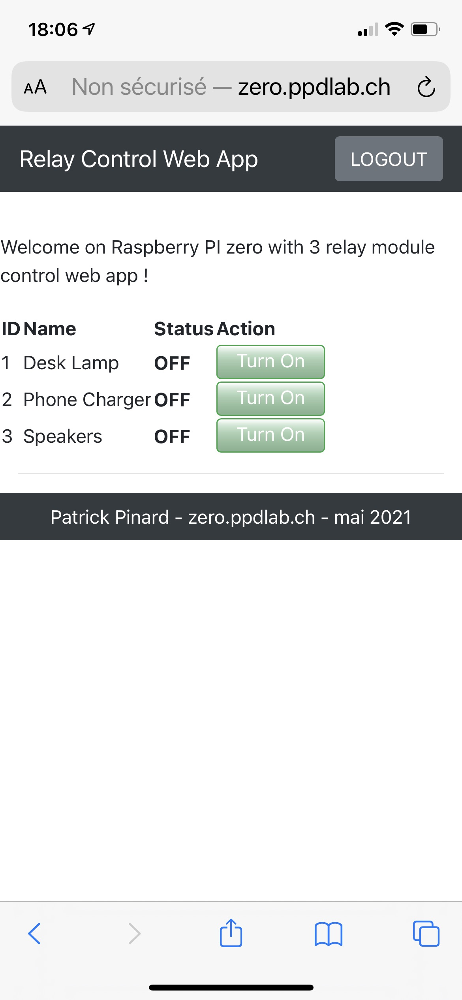
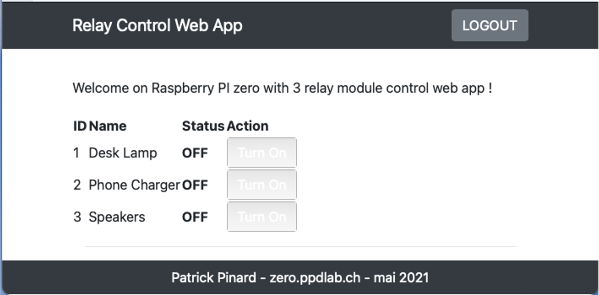
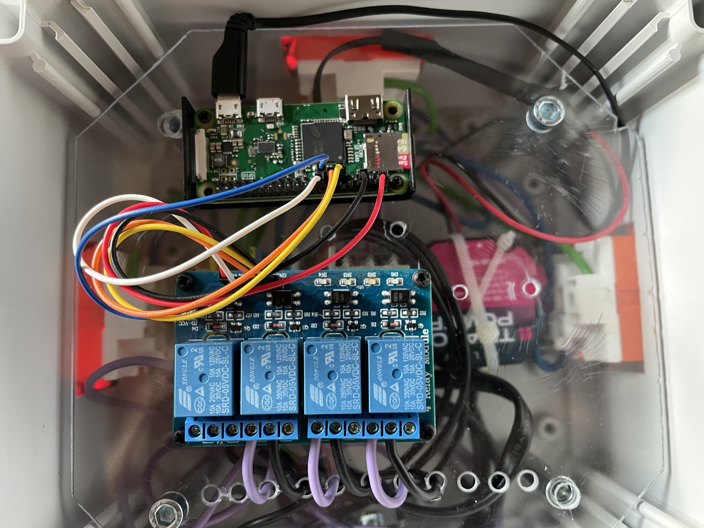

# Module Relais 240V
Boitier avec 3 prises 240V commandées via une interface Web en utilisant les technologies Restful API, Flask, bootstrap sur une Raspberry Pi zero.

Ce projet consiste à regrouper différentes technologies pour piloter un boitier électrique grâce à une application web simple via le wifi de la maison.

PinOut

Relays	  BOARD	  BCM

Relay 1	  11	    GPIO 17

Relay 2	  15	    GPIO 22

Relay 3	  13	    GPIO 27

Relay 4	  16	    GPIO 23

# Interface

Depuis un smartphone :

Depuis un PC :

# Boitier
Le boitier est construit en séparant la partie électrique 240V de la commande (Raspberry Pi zero et module relais) au maximum.

# Code
Le code est reprit de https://github.com/yusufcanb/flask-relay-control et adapté avec Bootstrap.

